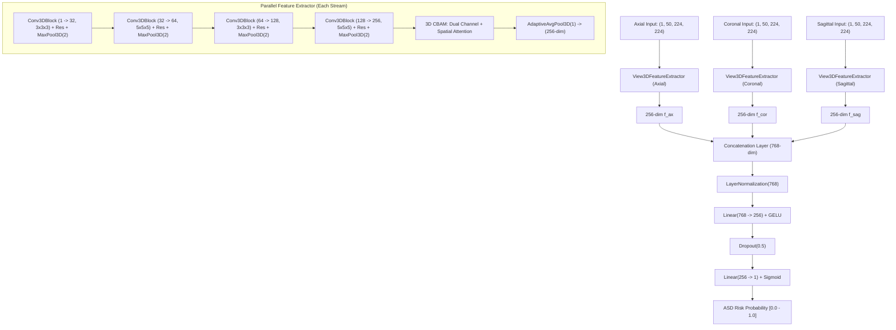

# AI-Powered 3D Multi-Planar Structural MRI Analysis Platform: Source of Truth (`context.md`)

This document is the master architectural blueprint and definitive source of truth for the project. Any AI agent modifying or expanding this codebase **must** read and maintain this document to reflect new design decisions, structural changes, and implementation milestones.

---

## 1. Project Overview & Methodology

This project implements an end-to-end 3D Volumetric Deep Learning research workstation for classifying Autism Spectrum Disorder (ASD) from T1-weighted structural Magnetic Resonance Imaging (sMRI) scans on the **ABIDE-I Dataset**.

The core methodology is adapted from **Hammash & Younis (2026)** (*MDPI Journal of Imaging*, 12(3), 109: *"A Hierarchical Multi-View Deep Learning Framework for Autism Classification Using Structural and Functional MRI"*).

### Core Architectural Principle
Instead of treating brain MRI as flat 2D slices or as an unstructured monolithic 3D cube, the framework decomposes each brain MRI scan into **three orthogonal anatomical volumetric streams (Axial, Coronal, and Sagittal)** at Full HD ($224 \times 224$) resolution, extracting 50 middle slices per plane. 

Each anatomical view is processed in parallel by an independent 3D Convolutional Neural Network (`Conv3D`) featuring:
1. **Alternating $3\times 3\times 3$ and $5\times 5\times 5$ Kernels:** Capturing both fine sulcal/gyral patterns and large-scale volumetric structures (e.g., ventricles, corpus callosum).
2. **Residual Skip Connections:** Preserving spatial gradient flow through deep volumetric layers.
3. **3D CBAM (Convolutional Block Attention Module):** Dynamic dual Channel and 3D Spatial Attention highlighting diagnostic biomarkers.
4. **Adaptive Focal Loss:** Handling class imbalance and forcing the model to focus on ambiguous and borderline cases.

---

## 2. Active Repository Structure

```text
dept internship/
├── context.md                                    # Master Project Blueprint & AI Source of Truth
├── app.py                                        # FastAPI Backend Server (API endpoints + web static server)
├── README.md                                     # Project overview and reproduction instructions
├── .gitignore                                    # Excludes caches, weights, raw scans, and processed tensors
│
├── inference/
│   └── engine.py                                 # Single-scan preprocessor, Conv3D-CBAM forward pass, CBAM attention hook, and feature norm analyzer
│
├── web/
│   ├── index.html                                # Semantic HTML5 Research Workstation layout
│   ├── style.css                                 # Clinical Research Light Theme design system
│   └── app.js                                    # Dual-layer Canvas renderer, 60fps slice scrubbers, attention toggle, and report generator
│
├── data/
│   ├── ABIDE_Phenotypic.csv                      # Official ABIDE-I phenotypic metadata table (ID, Site, DX_GROUP, Age, etc.)
│   └── sample_scans/                             # Verified sample NIfTI scans for instant testing
│       ├── nyu_0050952_asd_sample.nii.gz         # NYU Siemens 3T Sample (ASD-class)
│       └── um1_0050327_control_sample.nii.gz     # UM_1 GE 3T Sample (Neurotypical-class)
│
├── preprocessing/
│   ├── abide_3d_preprocessing_224_multisite.py   # Multi-site AWS S3 fetcher + Otsu + N4 bias + 224x224 3D tensor extractor
│   └── abide_3d_preprocessing_128_nyu.py         # Single-site NYU 128x128 3D tensor extractor
│
├── models/
│   ├── abide_3d_hierarchical_cnn_pytorch.py      # SOTA Multi-site PyTorch 3-Stream Conv3D + CBAM Attention network
│   └── abide_3d_hierarchical_cnn_128_nyu.py      # Single-site NYU TensorFlow/Keras Conv3D baseline
│
└── report/
    └── 3D_MultiPlanar_ASD_Research_Report.md     # Research report, methodology, and benchmark evaluation
```

---

## 3. Data Ingestion & Preprocessing Pipeline

### 3.1 Target Cohorts
- **Expanded Multi-Site Cohort ($N=395$):**
  - **Sites:** `NYU` (Siemens Allegra 3T), `UM_1` (GE Signa 3T), `USM` (Siemens Trio 3T).
  - **Distribution:** 192 ASD (48.6%), 203 Healthy Controls (51.4%).
  - **Target Resolution:** Full HD $224 \times 224$ (50 slices per view).
- **Single-Site NYU Cohort ($N=184$):**
  - **Distribution:** 79 ASD (42.9%), 105 Healthy Controls (57.1%).
  - **Target Resolution:** $128 \times 128$ (50 slices per view).

### 3.2 Automated Preprocessing Steps
Implemented in [`preprocessing/abide_3d_preprocessing_224_multisite.py`](file:///d:/Coding/dept%20internship/preprocessing/abide_3d_preprocessing_224_multisite.py) and wrapped dynamically inside [`inference/engine.py`](file:///d:/Coding/dept%20internship/inference/engine.py):

1. **Direct Ingestion & File Disambiguation:**
   - Raw MRI (`.nii`, `.nii.gz`): Triggers full automated preprocessing pipeline.
   - Preprocessed Tensor (`.npy`): Validated for dimensions $(50, 224, 224, 1)$ or $(128, 128, 128)$ and routed directly to model inference.
2. **Otsu Adaptive Brain Masking:** Performs slice-wise adaptive thresholding to remove non-brain scalp fat, skull, and background noise.
3. **N4 Bias Field Correction:** Removes low-frequency RF magnetic field shading gradients via spatial Gaussian filtering ($\sigma = 15$).
4. **Bounding Box Isolation:** Detects non-zero intensity coordinates to isolate and crop the brain tissue bounding box.
5. **Site-Harmonized Percentile Normalization:**
   - Truncates extreme intensity outliers to $[P_1, P_{99}]$.
   - Calculates mean and standard deviation on brain voxels: $Z = \frac{X - \mu}{\sigma}$.
   - Clips voxel intensities to $[-3.0, +3.0]$ to harmonize contrast histograms across Siemens and GE scanners.
6. **Multi-Planar 50-Slice Tensor Extraction:**
   - Locates the anatomical centroid and extracts 50 equidistant slices along each orthogonal axis.
   - Resizes each 2D slice to $(224, 224)$ via bicubic interpolation.
   - Formats tensors into 3D NumPy arrays:
     - `axial_50.npy` $\rightarrow$ Shape: $(50, 224, 224, 1)$
     - `coronal_50.npy` $\rightarrow$ Shape: $(50, 224, 224, 1)$
     - `sagittal_50.npy` $\rightarrow$ Shape: $(50, 224, 224, 1)$

---

## 4. Deep Learning Architecture Specification

Implemented in [`models/abide_3d_hierarchical_cnn_pytorch.py`](file:///d:/Coding/dept%20internship/models/abide_3d_hierarchical_cnn_pytorch.py):



### 4.1 Multi-View Feature Representation Analysis
- During inference, [`inference/engine.py`](file:///d:/Coding/dept%20internship/inference/engine.py) computes the genuine L2 activation norms:
  $$\|\mathbf{f}_{\text{ax}}\|_2, \quad \|\mathbf{f}_{\text{cor}}\|_2, \quad \|\mathbf{f}_{\text{sag}}\|_2$$
- Quantifies the relative representation share (%) across Axial, Coronal, and Sagittal streams.

### 4.2 3D CBAM Spatial Attention Extraction
- Hooks into `cbam.spatial_conv` to extract the spatial attention volume $sa$:
  $$sa = \sigma(\text{Conv3D}([\text{MeanChannel}(X) \,;\, \text{MaxChannel}(X)]))$$
- Interpolated trilinearly to $50 \times 224 \times 224$ and rendered as transparent amber/coral alpha heatmaps over the structural MRI slices.

---

## 5. Experimental Benchmark Results

Documented in [`report/3D_MultiPlanar_ASD_Research_Report.md`](file:///d:/Coding/dept%20internship/report/3D_MultiPlanar_ASD_Research_Report.md):

### 5.1 Benchmark Summary
| Model Architecture | Cohort ($N$) | Resolution | Evaluation Protocol | Peak Accuracy | 5-Fold Average |
| :--- | :--- | :--- | :--- | :--- | :--- |
| Single-Slice 2D Baseline | NYU ($N=184$) | 1 Slice | Train/Test Split | `56.25%` | N/A |
| 2.5D Multi-Site Model | ABIDE ($N=395$) | 3 Slices | Single Run | `63.62%` | N/A |
| 3D Single-Site Conv3D | NYU ($N=184$) | $128 \times 128$ | Stratified 5-Fold CV | **`75.00%`** | **`69.59%`** |
| **3D Multi-Site PyTorch Model** | **NYU+UM1+USM ($N=395$)** | **$224 \times 224$ HD** | **Stratified 5-Fold CV** | **`75.95%`** 🔥 | **`66.84%`** |

### 5.2 Multi-Site 5-Fold Stratified Breakdown ($N=395$)
- **Fold 1:** **`75.95%`** (Peak Result)
- **Fold 2:** `62.03%`
- **Fold 3:** `63.29%`
- **Fold 4:** `68.35%`
- **Fold 5:** `64.56%`
- **Final Cross-Validation Mean:** **`66.84%`**

---

## 6. Live Research Workstation (`app.py` & `web/`)

The application is deployed as a high-performance clinical research workstation running on `http://127.0.0.1:8000`:
- **Scan Ingestion:** Drag-and-drop `.nii` / `.nii.gz` / `.npy` or select 1-click curated research samples (`nyu_asd`, `um1_control`).
- **Pipeline Stepper:** Real-time visual tracking of all 6 processing stages.
- **Center Viewports:** Tri-planar synchronized Axial, Coronal, Sagittal canvases with 50-slice scrubbers and toggleable 3D CBAM spatial attention overlays.
- **Research Analytics:** ASD Classification Probability gauge, Model Output pill, Multi-View feature representation norms, Preprocessing QC checklist, and one-click Markdown report export.
- **Persistent Disclaimer:** *"Research use only — not for clinical diagnostic use."*
