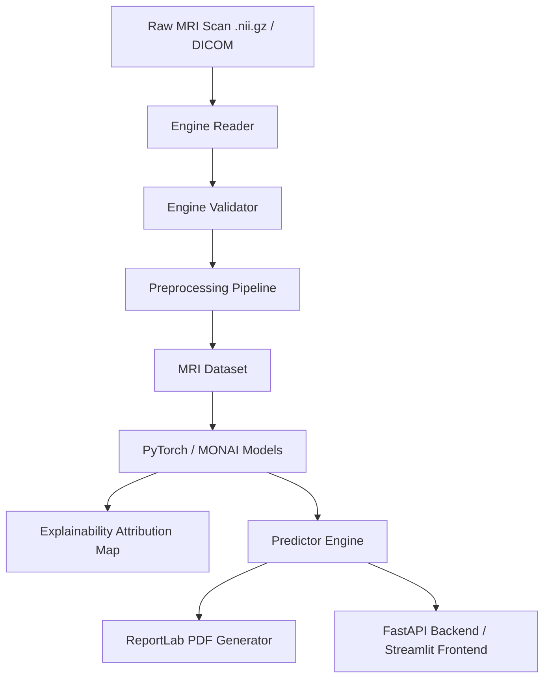

# Architecture Design

This document details the system design of the AI-powered Structural MRI Analysis Platform.

## System Overview

## core Modules
- `core/interfaces.py`: Strictly typed contracts using Abstract Base Classes (ABCs) that all components extend.
- `core/config.py`: Single source of truth configuration handling using Pydantic Settings.
- `core/logging.py`: Structured multithreaded and process-safe logging mapped to directory-specific files.
- `schemas/`: Pydantic models for domain entity safety.
